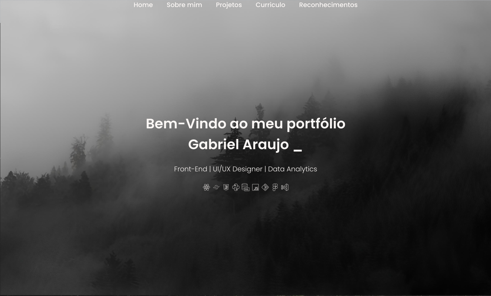

<h1 align="center">Meu Portfólio</h1>
<h2 align="center">By Bieelx</h2>

Este repositório contém o código do meu portfólio pessoal, desenvolvido com o intuito de apresentar meus projetos, habilidades e experiências como desenvolvedor. Este é o primeiro site que criei e vou disponibilizar para o público, e é totalmente responsivo, adaptando-se tanto para desktop quanto para dispositivos móveis.

## 🚀 Tecnologias

Este projeto foi desenvolvido utilizando as seguintes tecnologias:
- **React**: Para a criação da estrutura e componentes dinâmicos da interface.
- **CSS**: Para estilização e responsividade do layout.
- **Figma**: Para o design da interface do usuário.
- **Canva**: Para a criação de elementos visuais como ícones e gráficos.

## 💻 Projeto

Este portfólio foi desenvolvido com o objetivo de exibir meus conhecimentos e projetos como desenvolvedor. Ele contém seções onde você pode visualizar:
- Meus **projetos** mais recentes, com descrições e links para acesso.
- Minhas **habilidades técnicas**, com ênfase em front-end.
- Informações sobre minha **formação** e **experiência** profissional.
- Uma **seção de contato**, permitindo que você entre em contato comigo diretamente.

O design é totalmente responsivo, ou seja, o site foi projetado para oferecer uma boa experiência de navegação tanto em telas grandes quanto em dispositivos móveis. Meu objetivo com esse projeto foi criar uma plataforma simples, mas elegante, onde as pessoas podem conhecer mais sobre o meu trabalho e experiência.

